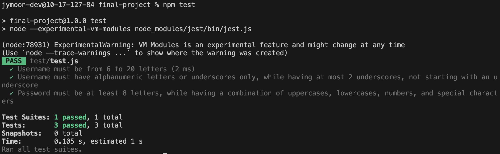

Milestone 03
===

Repository Link
---
https://github.com/nyu-csci-ua-0467-001-002-fall-2024/final-project-junyong-moon.git

URL for deployed site 
---
http://linserv1.cims.nyu.edu:29249

URL for form 1 (from previous milestone) 
---
* [Form for searching (login not needed)](http://linserv1.cims.nyu.edu:29249/posts)
* [Form for posting (login needed)](http://linserv1.cims.nyu.edu:29249/posts/add)

Special Instructions for Form 1
---
For login, please use the following account:
- id: superuser
- password: PASSword1!

URL for form 2 (for current milestone)
---
* [Form for adding a comment (login needed)](http://linserv1.cims.nyu.edu:29249/posts/please-test-post-requests-here)

Special Instructions for Form 2
---
For login, please use the following account:
- id: superuser
- password: PASSword1!

After login, please navigate to Posts section (in the top navigation bar),
then find a post named 'Please test POST requests here.' Thanks! 

URL(s) to github repository with commits that show progress on research
--- 
The Tailwind CSS classes in elements present in the hbs files are complied to [output.css](src/output.css) file.

For the representativeness of the layout file, please refer to the [layout.hbs](views/layout.hbs) file.

Also, the link to the [tailwind config](tailwind.config.js) is also attached here.

In this milestone, unit testing with jest has been added. The link [Jest Unit Testing](test/test.js) in the repository shows the progress in the research.

Also, here is a sample result of the unit testing: 

References 
---
[Jest Tutorial](https://jestjs.io/docs/getting-started)

[Populating Nested Objects](https://stackoverflow.com/questions/19222520/populate-nested-array-in-mongoose)

[Regex testing for username](https://stackoverflow.com/questions/336210/regular-expression-for-alphanumeric-and-underscores)

[Using Jest with ESModule enabled](https://stackoverflow.com/questions/35756479/does-jest-support-es6-import-export)