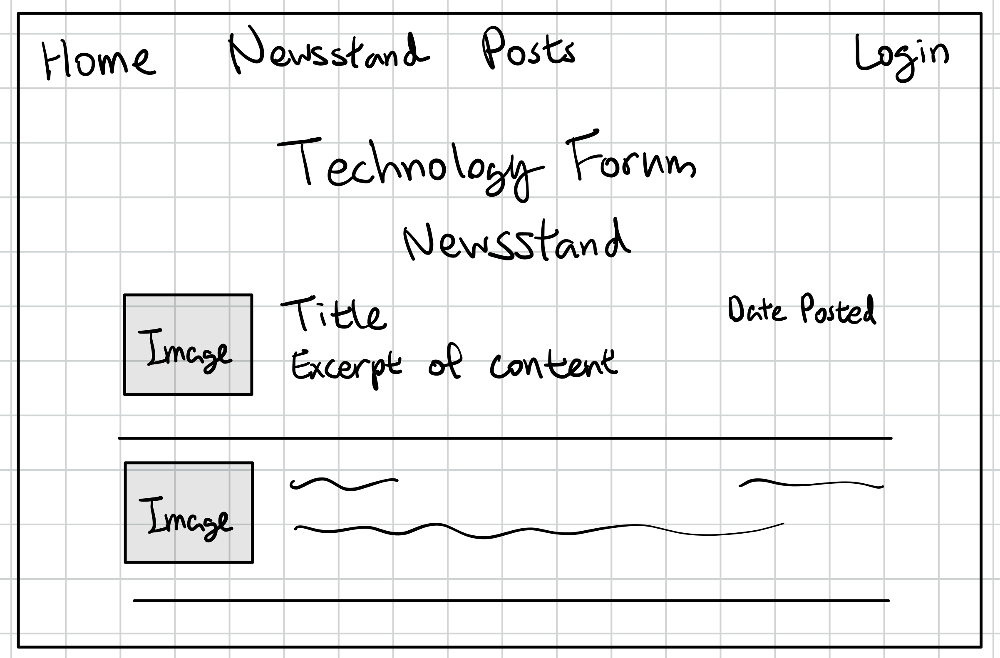
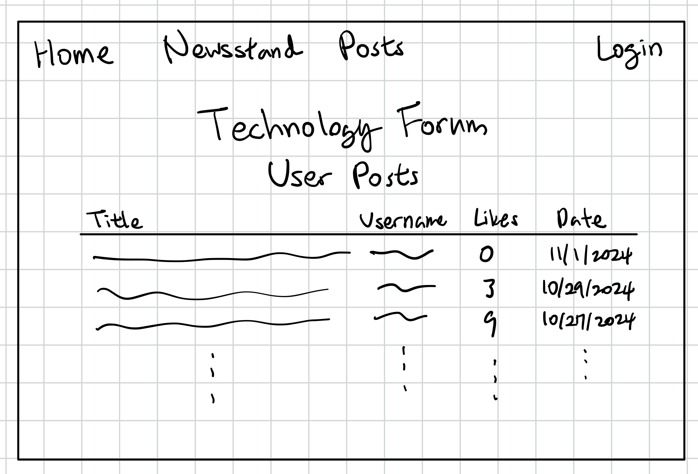
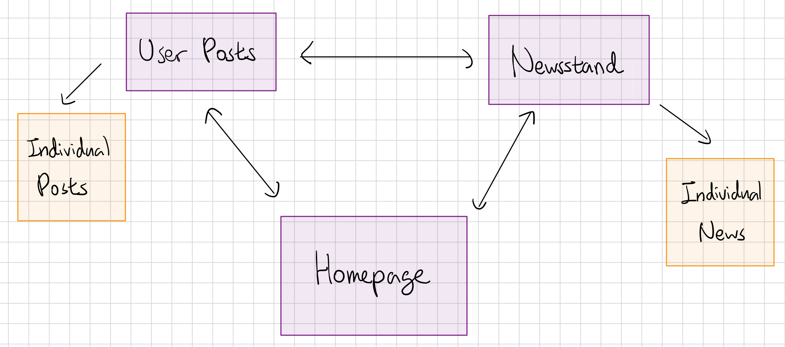

# Technology Forum (Tentative Name - subject to change)

## Overview

Technology Forum is a community to share tech information and knowledge, for developers and technology enthusiasts. It is a simple website consisting of a newsstand--where administrators and authorized users share news--and a forum--where users and post information/questions to the related topics. After registration, users are free to share their opinion and knowledge, as well as to rant about recent Apple product! Not only can they do this in a post, but they may do so in a comment, given that the language is appropriate.


## Data Model

The application will store Users, Articles, (user-written) Posts, and Comments

* Each user contains login/authentification credentials
* Each article and post will have views and comments

An Example User:
```javascript
{
  username: "sample_username",
  hash: // a password hash
  email: // an email address to the user
  registationDate: // the date when the user registrated
  postReacted: // the list of posts that the user liked/disliked
  isAdmin: // If the user has the permission to administrate the website
}
```

An Example of Article:
```javascript
{
    title: // title of the article
    content: // the content of the article
    views: // the number of total views
    // likes: // the number of likes
    comments: // comments of the article
    createdAt: // timestamp
}
```

An Example of user-written Post:
```javascript
{
    title: // title of the post
    content: // the content of the post
    writtenBy: // the ObjectID that points to the user
    views: 5,
    // likes: 0,
    comments: // comments of the article
    createdAt: // timestamp
}
```

An Example of Comment:
```javascript
{
    content: // content of the comment
    writtenBy: // the ObjectID that points to the user
    createdAt: // timestamp
}
```

## [Link to Commented First Draft Schema](db.mjs) 

Please follow the link to view the codebase for the first draft schema.

## Wireframes

This shows a quick overview of each pages, although each page design has not yet become concrete.
More features and pages will be added as I progress with the project.
(Implementation of each new and post, for example)

/news - displays news title, excerpt of the content, date posted, and one photo (lists them latest to oldest)



/posts - displays post title, username, date posted, and number of likes (lists them latest to oldest)

Access to this page requires registration.



## Site map



## User Stories or Use Cases

1. As non-registered user, I can register a new account with the site
  * Even as unregistered, I can read articles, but not user-written posts
2. As a user, I can log in to the site
3. As a user, I can react to articles, user-written posts, and comments
4. As a user, I can view the list of articles and posts that I liked or disliked
5. As a user, I can upload a request to become an authorized user
  * As an authorized user, I can add a news article to the Newsstand

## Research Topics

Here is a tentative list of research that I would like to explore:

* (3 points) Unit testing with JavaScript (Implemented, 4th test needed)
* ~~(3 points) Built tools / task runners such as vite, Webpack, along with:~~
* (2 points) Integrate ESLint into the workflow (Implemented)
* (2 points) CSS framework or UI toolkit, use a reasonable of customization of the framework (Implemented, customization needed)
* (3 points) Configuration management through `nconf` (Implemented)

I am planning to fulfill 10 points total out of 10 required points.


## [Link to Initial Main Project File](app.mjs) 

Please follow the link to view the codebase for `app.mjs`.

## Annotations / References Used

* https://mherman.org/blog/local-authentication-with-passport-and-express-4/
  Tutorial for authentification

* https://www.npmjs.com/package/mongoose-slug-plugin
  Reference for Mongoose Slug Plugin

* https://www.geeksforgeeks.org/how-to-do-a-full-text-search-in-mongodb-using-mongoose/
  Reference for searching text in mongoose

* https://tailwindcss.com/docs/installation
  Tutorial for installing Tailwind CSS

* https://tailwindcss.com/docs/utility-first
  Reference for basic Tailwind CSS syntax